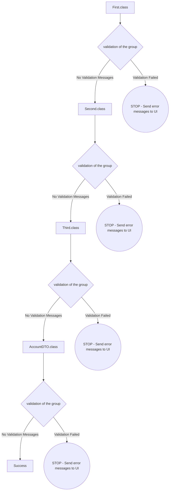

# Spring Boot Custom Validations and Exception Handling
In this example, we will cover following things.
- Basic Validations
- Custom Defined Validation
- Reusing the Custom Validations for multiple classes
- Custom Validations with Group Sequence
- Response Object
- Control Advice Exception Class

## Basic Validations
Basic Validations like `@NotEmpty` , `@Size` , `@NotNull` etc.
```java
@NotEmpty(message = "{account.name.notempty}",groups = {First.class})
@Size(min = 3,max = 50,message = "{account.name.size}",groups = {Second.class})
private String name;
@NotEmpty(message = "{account.type.notempty}",groups = {First.class})
@Size(min = 2,max = 50,message = "{account.type.size}",groups = {Second.class})
private String type;
@NotNull(message = "{account.amount.notnull}",groups = {First.class})
@DecimalMin(value = "99.00",inclusive = false,message = "{account.amount.min}",groups = {Second.class})
@DecimalMax(value = "1000.00",inclusive = true,message = "{account.amount.max}",groups = {Second.class})
private BigDecimal amount;    
```
 
## Defined Custom Validation
Created one Custom Validator called `@UniqueValue`, it accepts two parameters (`methodName` & `className`) . 
```java
@UniqueValue(
methodName = "findByAccountName",
className  = "com.tech.mkblogs.account.service.AccountService"
message    = "{account.name.alreadyexists}",
groups     = Default.class
) 
```
```java
@Documented
@Retention(RetentionPolicy.RUNTIME)
@Target({ElementType.ANNOTATION_TYPE, ElementType.TYPE})
@Constraint(validatedBy = UniqueValueValidator.class)
public @interface UniqueValue {
    String message() default "Already exists value";
    Class<?>[] groups() default {};
    Class<? extends Payload>[] payload() default {};	    
    String methodName();
    String className();
}
```
### Implementation of `@UniqueValue` validator class
  ```java
  public class UniqueValueValidator implements ConstraintValidator<UniqueValue, Object>{
    private String className;
    private String methodName;

   @Override
    public void initialize(UniqueValue unique) {
		this.methodName = unique.methodName();
		this.className = unique.className();
	}
	
@Override
	public boolean isValid(Object value, ConstraintValidatorContext context) {
	 //1 Check the Object type as per requirement
     //2 using java reflection call the service and check value exists or not	
	}
  }
  ```
 First validator creates object of service class then calls the given method and return db values.
After that validator check size is empty or not. It size is not empty then validator should return true otherwise false.
We can reuse the same validator for other object by passing different class and method
```java
@UniqueValue(
methodName = "findByUserName",
className  = "com.tech.mkblogs.user.service.UserService",
message    = "{user.username.alreadyexists}",
groups     = Default.class
)
 ```
## Reuse Custom Validation
```java
@UniqueValue(
methodName = "<<methodName>>",
className  = "<<className>>",
message    = "<<messagee>>",
groups     = <<groupname if required>>
)
```
## Group Sequence
By default, constraints are evaluated in no particular order, regardless of which groups they belong to. In some situations, however, it is useful to control the order constraints are evaluated.
In order to implement custom validation order we just need to define an interface and annotate it with `@GroupSequence`, defining the order in which the groups have to be validated. If at least one constraint fails in a sequenced group none of the constraints of the following groups in the sequence get validated.

`@GroupSequence` is a class level annotation
```java
@GroupSequence({First.class,Second.class,AccountDTO.class})
```
And flow charts like this: 

## Response Object
```java
public class ResponseDTO <S,E> {
   private Boolean isError;
   private S successObject;
   private E errorObject;	
}
```
## Exception Handling
A controller advice allows you to use exactly the same exception handling techniques but apply them across the whole application, not just to an individual controller. You can think of them as an annotation driven interceptor.

```java
@ControllerAdvice
public class RestExceptionHandler extends ResponseEntityExceptionHandler {
//define all exception classes here
//sample code
    @Override
    protected ResponseEntity<Object> handleMethodArgumentNotValid(
            MethodArgumentNotValidException ex,
            HttpHeaders headers,
            HttpStatus status,
            WebRequest request) {
        
    	ResponseDTO<Object, List<ErrorObject>> responseDTO = new ResponseDTO<>();
    	responseDTO.setIsError(true);
    	List<ErrorObject> errorList = new ArrayList<ErrorObject>();
        
        if(ex.getBindingResult().hasGlobalErrors()) {        	
        	List<ObjectError> list = ex.getBindingResult().getGlobalErrors();
        	errorList.addAll(list.stream()
        			.map(error -> ErrorObject.of(error.getObjectName(), error.getObjectName(), error.getDefaultMessage()))
        			.collect(Collectors.toList()));
        }else {
        	if(ex.getBindingResult().hasErrors()) {
        		List<FieldError> list = ex.getBindingResult().getFieldErrors();        		
        		errorList.addAll(list.stream()
    				.map(error -> ErrorObject.of(error.getField(), error.getObjectName(), error.getDefaultMessage()))
    				.collect(Collectors.toList()));
            }
        }        
        responseDTO.setErrorObject(errorList);
        return ResponseEntity.ok().body(responseDTO);
    }
}
```
